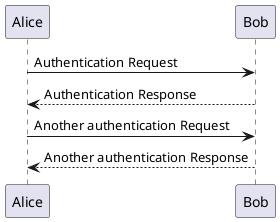
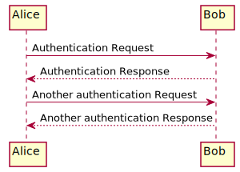

# PlantUML

[PlantUML](https://plantuml.com/) is a great library for creating diagrams that can be used for software design purposes. This document goes through the process of rendering these diagrams inside of a Markdown (`.md`) file. The local rendering instructions are specifically only for Ubuntu 20.04, and Visual Studio Code. Using any other platform or editor may need alternative methods.

The process for rendering the plantuml diagrams was acquired from [here](https://gist.github.com/noamtamim/f11982b28602bd7e604c233fbe9d910f).

## Local Rendering
This is the process I went through on Ubuntu 20.04 to get plantUML rendered using Visual Studio Code.

### Software Requirements

#### VS Code extensions:
- Markdown Preview Enhanced
- PlantUML

#### Install:
- Java: `sudo apt install default-jre`
- graphviz: `sudo apt install graphviz`

### Render
Create your plantuml diagram inside of a markdown `.md` file

Use `Markdown Preview Enhanced` to open the preview to the side. The button for this in VS Code is in the upper right side of the text editor window.

#### example PlantUML diagram:
````

````

## Github Rendering

### Software Requirements
#### Install:
- PlantUML: `sudo apt-get install -y plantuml`

### Re-formatting
Create your plantuml diagram like you did before, but surround it with comments `<!--` & `-->`. This will cause your plantuml source text to not render in `Markdown Preview Enhanced` or in `Github`. For `Markdown Preview Enhanced`, your diagram will disappear.

Note: A `-->` is sometimes used inside a plantuml diagram, and will break the above commenting syntax. Two workarounds are to use `--_>` instead, inside the plantuml diagram. (At the time of writing, this may be a beta feature. Other workarounds may be possible)

You also need to add a title to your diagram. The title goes after the `@startuml` tag.

#### Example PlantUML diagram:
````
<!--

-->
````

#### Generate Diagrams
Use PlantUML to generate the diagrams for your markdown file. PlantUML will ignore the comments you inserted in the above step.

Generate the diagrams using the `.svg` format, and place them in the directory `resources`.
`plantuml -tsvg -o resources FILENAME.md`

The example PlantUML diagram will be saved in `resources/ExampleDiagram.svg`.

#### Render generated Diagrams
Render your PlantUML diagram in your markdown file by referencing the generated file with the following syntax:
``

This will enable your diagram to be rendered using both `Markdown Preview Enhanced` and `Github`

#### Render in Github
When your markdown file is complete, commit both the markdown file and all related `.svg` files, and push them to your repository. When you open that file in github, all PlantUML diagrams should be rendered.

#### Rendered Example
Here's the example diagram, rendered.


