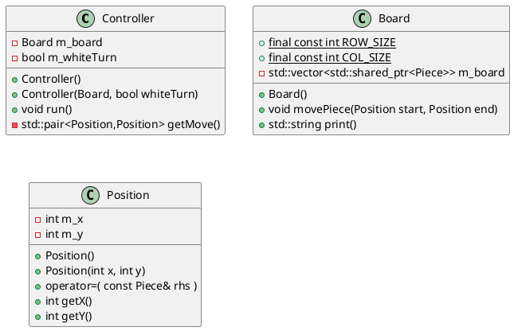
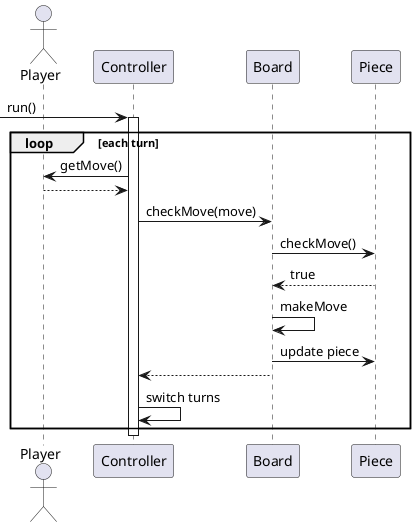

# Chess

This program will be written in C++. It is a simple chess program, using a command line interface, and simple ascii graphics. The main purpose of this program is to practice the design and creation of a project.

## Design Goals

- Learn and use new features from C++14 & C++17

## Assumptions

N/A

## Limitations

1. GUI is command line only
2. Graphics are ascii only
3. There will be no computer AI

## Components

- Controller
  - The Controller will contain the main game loop, and manage user input.
- Board
  - The board will keep track of all piece locations, and will provide an ascii output of the board.
- Piece(s)
  - The Piece(s) will verify valid moves, and contain internal data for each piece.

## Class Diagrams

<!--

-->

Only the King piece is shown below as an example. Otherwise only pieces that have added information from the base class are included.

## Program Flow

<!--

-->

